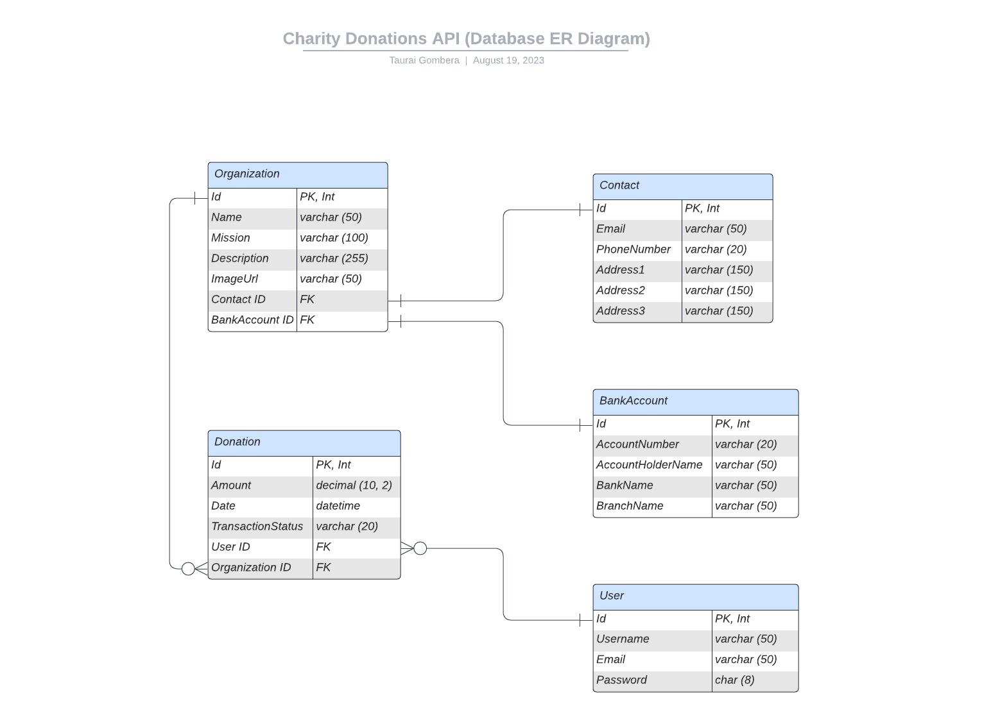

# Charity Donation API - Requirements Document

## 1. Introduction

The Charity Donation API project aims to create a platform that facilitates online donations to charitable organizations in Malawi. The API will allow users to donate to various causes, view their donation history, and provide organizations with an interface to manage their profiles.

## 2. Functional Requirements

### 2.1 User Registration and Authentication

- Users must be able to register an account with the system.
- The API must support user authentication through email and password.

### 2.2 Organization Management

- Charitable organizations must be able to register and manage their profiles.
- Each organization must provide a name, mission, and description. See [Organization Entity](https://github.com/tauraigombera/charity-donations/tree/main/Docs/Entities/Organization.Entity.md).
- Organizations should be able to add contact information, including email and phone number. See [Contact Entity](https://github.com/tauraigombera/charity-donations/tree/main/Docs/Entities/Contact.Entity.md).
- Organizations must be able to add bank account details to receive donations securely. See [Bank Account Entity](https://github.com/tauraigombera/charity-donations/tree/main/Docs/Entities/BankAccount.Entity.md).

### 2.3 Donation Processing

- Authenticated users should be able to make donations to registered organizations.
- The API must support various donation amounts and validate them.
- Donation transactions should include the organization, user, amount, date, and transaction status.

### 2.4 Donation History

- Authenticated users should be able to view their donation history.
- The donation history should show a list of past donations made by the user.

### 2.5 Search and Filter Organizations

- The API must provide endpoints for searching and filtering organizations based on name, cause, location, etc.

### 3. Database ER Diagram

## 4. Non-Functional Requirements

### 4.1 Security

- User passwords must be encrypted and securely stored.
- Access to sensitive endpoints should be restricted to authenticated users only through Auth0.
- Donation transactions and bank account details must be transmitted securely using HTTPS.

### 4.2 Performance

- The API should be designed for optimal performance and responsiveness.
- Database queries should be optimized to handle a large number of concurrent users.

### 4.3 Scalability

- The system should be designed to handle potential growth in users and donations.
- The API and database architecture should be scalable as the user base expands.

### 4.4 Documentation

- The API should be well-documented with clear instructions on how to use each endpoint using Swagger UI.
- The codebase should include inline comments and explanations for complex logic.

## 5. Technology Stack

- Backend: [.NET 7.0](https://learn.microsoft.com/en-us/dotnet/core/whats-new/dotnet-7)
- Database: [Microsoft SQL Server](https://hub.docker.com/_/microsoft-mssql-server)
- Frontend: [Next.js](https://nextjs.org/)
- Authentication and authorization: [Auth0](https://auth0.com/)

## 6. Deployment

- The API and frontend (if applicable) should be deployable on cloud platforms like Azure, AWS, or Heroku.

## 7. Open-Source

- The project will be open-sourced under a suitable open-source license.
- Detailed instructions on how to contribute to the project should be provided in the repository.

## 8. Testing

- Unit tests using XUnit should be written to validate the functionality of the API endpoints.
- Integration tests can be used to ensure proper communication between frontend and backend.

## 9. Future Enhancements

- Allow users to view and filter organizations based on their causes and locations.
- Implement a rating and review system for organizations.
- Integrate with popular payment gateways to process donations securely.

---

This requirements document outlines the main features, non-functional aspects, technology stack, deployment, and testing considerations for the Charity Donation API project. It provides a foundation for the development process and ensures that the project meets its goals.
